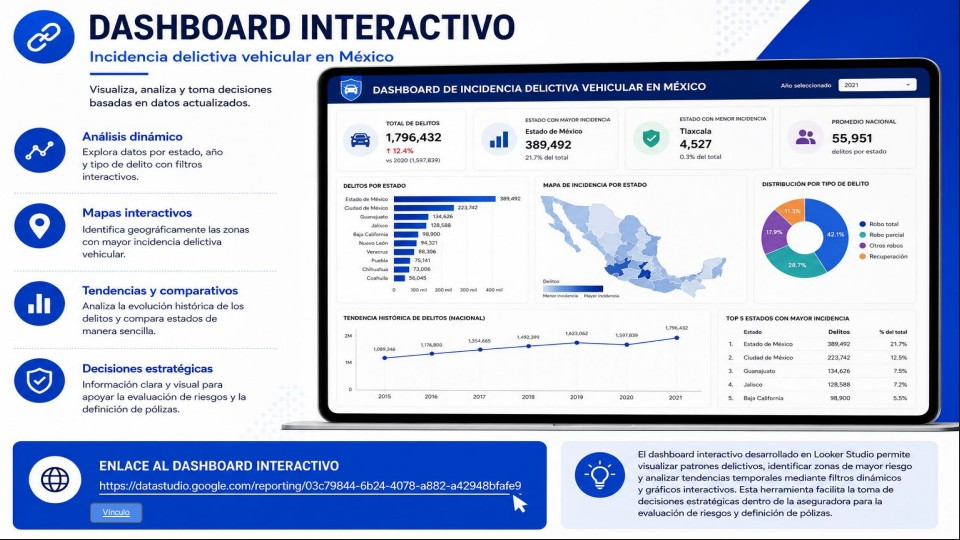
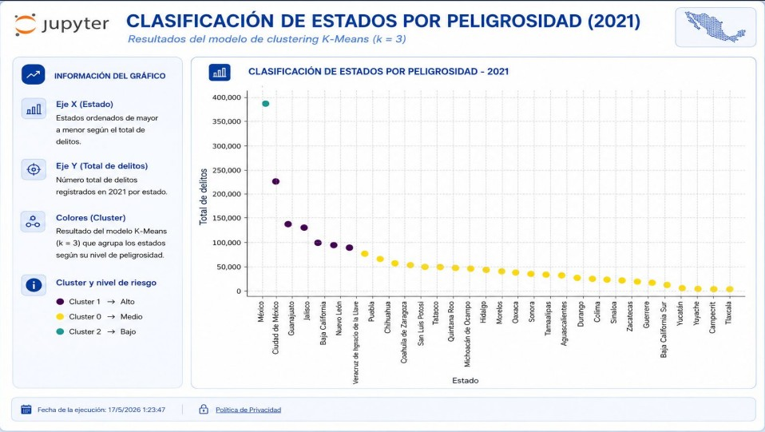
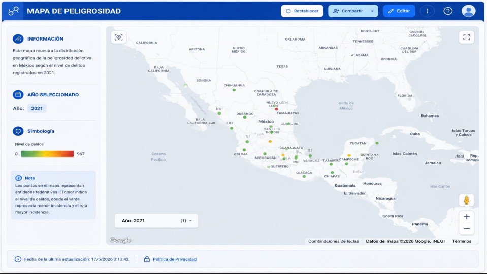

# 🚗 Vehicle Crime Risk Analytics for Insurance Pricing in Mexico

## Overview

This project analyzes vehicle-related crime incidents across Mexican municipalities and states to identify risk patterns, historical trends, and geographic hotspots that can support data-driven decision-making within the insurance industry.

Using SQL Server, Python, Machine Learning, and Business Intelligence tools, public crime data was transformed into actionable insights for risk assessment, premium pricing strategies, and territory segmentation.

⸻

## Business Problem

Insurance companies need accurate risk assessments to establish competitive and profitable premium pricing.

Vehicle-related crime varies significantly across regions in Mexico, directly affecting claim probability and financial exposure. Understanding these geographic differences is essential for identifying high-risk areas, optimizing pricing strategies, and improving risk management processes.

Business Question

Which states and municipalities present the highest vehicle crime risk, and how can this information support more effective insurance pricing and risk assessment strategies?

⸻

## Project Objectives

* Analyze vehicle-related crime incidents across Mexico.
* Identify historical crime patterns and trends.
* Classify states according to risk level.
* Forecast future crime behavior.
* Support insurance pricing and risk management decisions through data analytics.
  
⸻

## Data Source

Source: National Public Security System (SESNSP)

Coverage

* 32 Mexican states
* 2,469 municipalities
* Historical records from 2015 to 2021
* Vehicle-related crime incidents

Format

* CSV files
* UTF-8 encoding
* Open government data
  
⸻

## Tools & Technologies

* SQL Server
* Python
* Pandas
* NumPy
* PyODBC
* Scikit-Learn
* Matplotlib
* Looker Studio
* Git & GitHub

⸻

## Methodology

1. Data Storage & Management

SQL Server was used to store and organize municipal crime data, enabling efficient querying and integration with analytical tools.

2. Data Extraction

Python and PyODBC were used to establish a connection with SQL Server and retrieve the required information for analysis.

3. Data Cleaning & Transformation

Data preparation included:

* Null value validation
* Duplicate removal
* Data type optimization
* Variable standardization

4. Exploratory Data Analysis (EDA)

Historical crime patterns were analyzed to identify trends, geographic concentrations, and behavioral insights.

5. Time Series Analysis

Vehicle crime evolution between 2015 and 2021 was examined to detect significant changes and long-term patterns.

6. Predictive Modeling

A Linear Regression model was developed to estimate vehicle crime incidence for 2022.

7. Risk Segmentation

The K-Means clustering algorithm was implemented to classify states into three categories:

* High Risk
* Medium Risk
* Low Risk

⸻

## Key Findings

Highest Crime Incidence

The State of Mexico and Mexico City recorded the highest concentration of vehicle-related crimes during the analyzed period.

Historical Trend

Vehicle crime incidents showed continuous growth between 2015 and 2019, followed by a decline in 2020 and a partial recovery in 2021.

Risk Classification

K-Means clustering successfully segmented states according to their crime exposure levels, facilitating geographic risk assessment.

2022 Forecast

The predictive model estimated approximately 242,000 vehicle-related crimes for 2022 under the continuation of historical trends.

Geographic Insights

Interactive dashboards and risk maps revealed regional crime concentration patterns and high-risk territories.

⸻

## Dashboard & Visualizations

The following visualizations summarize the main findings, risk segmentation results, and geographic insights generated throughout the project.

Executive Dashboard

<p align="center">
  
</p>

State Risk Classification

<p align="center">
  
</p>

Vehicle Crime Risk Map

<p align="center">
  
</p>

⸻
## Business Impact

The insights generated by this project can support:

* Improved insurance risk assessment.
* More accurate premium pricing strategies.
* Identification of high-exposure territories.
* Better resource allocation.
* Data-driven decision-making.
* Preventive actions focused on high-risk areas.

⸻

## Project Limitations

* The analysis is based on historical information available through 2021.
* The predictive model uses Linear Regression and could be enhanced with more advanced forecasting techniques.
* Socioeconomic, mobility, and population density variables were not included.
* Results depend on the quality and completeness of publicly available records.
* The model provides risk estimation support but does not replace actuarial models used by insurance companies.

⸻

## Lessons Learned

Throughout this project, I strengthened my skills in:

* SQL Server database management.
* Data extraction and transformation using Python.
* Large-scale data cleaning and preparation.
* Predictive analytics fundamentals.
* Clustering techniques for risk segmentation.
* Business-oriented dashboard development.
* Translating analytical results into strategic recommendations.

⸻

## Challenges

* Integrating multi-year data from thousands of municipalities.
* Standardizing information to ensure analytical consistency.
* Connecting SQL Server, Python, and Looker Studio within a unified workflow.
* Interpreting results from a business perspective rather than solely a technical one.

⸻

## Recommendations

* Adjust insurance premiums based on regional risk exposure.
* Continuously monitor vehicle crime trends.
* Develop preventive strategies for high-risk areas.
* Incorporate socioeconomic and mobility variables into future models.
* Implement more advanced forecasting techniques to improve predictive accuracy.

⸻

## Conclusion

This project demonstrates how data analytics can transform public information into strategic decision-making tools. By combining SQL Server, Python, Machine Learning, and Business Intelligence, it was possible to identify risk patterns, segment territories, and generate actionable insights that support insurance pricing and risk management strategies.

⸻

## Author

*Ali Vega*  
Data Analytics • Cloud Computing

---

## Repository Structure

```text
vehicular-crime-risk-analytics-mexico
├── README.md
└── report
    └── Vehicular Crime Risk Analytics in Mexico.pdf
└── Images
    ├── executive-dashboard.png
    ├── state-risk-classification.png
    └── vehicle-crime-risk-map.png
```
